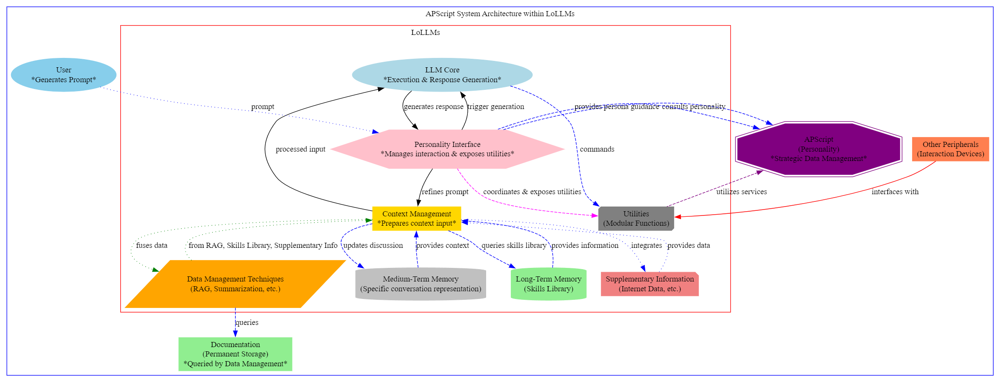

# Scripted personalities building documentation

This documentation was written by lollms after reading its own code with the help of ParisNeo.

## Introduction to LoLLMs and APScript Integration

Welcome to the integration guide for LoLLMs (Lord of Large Language Multimodal Systems) and APScript, designed for developers ready to advance the capabilities of AI in their projects. Created by ParisNeo, LoLLMs sets a new standard in AI development, emphasizing the creation of AI entities that go beyond traditional functionalities to become dynamic partners in various applications.

This documentation aims to provide a concise yet comprehensive overview for developers to effectively integrate the innovative features of APScript with the foundational principles of LoLLMs. Whether your focus is on robotics, digital assistance, or any area where AI can contribute significantly, this guide is your starting point for developing AI personalities that are both technically sophisticated and practically impactful.

The journey with LoLLMs and APScript is about pushing the limits of AI to enhance both the digital and physical realms. As we explore the integration and application of scripted personalities, we invite developers to contribute to this evolving field, shaping the future of AI together.

Let's embark on this journey to unlock the full potential of your AI projects, making AI not just a tool, but a transformative force in your work. Welcome to the next step in AI development with LoLLMs and APScript.

## Lollms architecture as viewed from personality perspective
The comprehensive architecture of the LoLLMs (Lord of Large Language Multimodal Systems) as envisioned by ParisNeo encompasses a sophisticated integration of multiple subsystems, each designed to fulfill specific roles within the broader framework of AI-driven interactions and functionalities. The system's architecture is centered around enhancing user interactions through the implementation of a dynamic and personality-infused interface, supported by advanced data management techniques and modular utilities. Below is a detailed description of the architecture's components and their interactions:

<a href="architecture.png" target="_blank">
  
</a>


## Core Components

- **LLM Core**: At the heart of the system lies the LLM Core, responsible for the execution of tasks and the generation of responses. This component processes inputs refined by the Context Management subsystem and generates outputs that are informed by the system's personality and the contextual information at hand.

- **Personality Interface**: This crucial interface manages the interactions between the user and the LLM Core, ensuring that inputs are refined for optimal processing and that the generated responses are aligned with the system's personality traits. It plays a pivotal role in maintaining the coherence and relevance of conversations. Additionally, it exposes utilities to the personality module (APScript), allowing for a more nuanced and sophisticated application of the system's personality.

- **Context Management**: This subsystem prepares the context input for the LLM Core, ensuring that the information is optimally structured. It also updates the context based on ongoing discussions, leveraging both Medium-Term and Long-Term Memory to maintain conversational coherence and relevance.

- **Data Management Techniques**: Incorporating strategies such as Retrieval-Augmented Generation (RAG) and Summarization, this component fuses data from various sources, including the system's Long-Term Memory and Supplementary Information, to enrich the context and content of responses.

- **Medium-Term Memory**: Represents the specific conversation representation, holding information that is pertinent to the ongoing interaction, thus enabling the system to maintain a thread of continuity throughout the conversation.

- **Long-Term Memory**: Acts as the system's skills library, storing a wide array of information and skills that the system can query to enhance its responses and actions.

- **Supplementary Information**: This component integrates internet data and other external sources of information, providing a layer of real-time relevance and updating the context management subsystem with fresh data as necessary.

- **Utilities**: A collection of modular functions that the system can leverage for various tasks, ranging from executing commands to interfacing with other peripherals. The Personality Interface coordinates and exposes these utilities, allowing the APScript to utilize them directly for a more dynamic interaction capability.

- **Other Peripherals**: Represents interaction devices and external systems that the LoLLMs can interface with, extending its functionality and interaction capabilities beyond traditional inputs and outputs.

### Supportive Components

- **APScript**: The personality module that defines the strategic data management and personality traits of the system. It consults with the Personality Interface for persona guidance and leverages the Utilities subsystem to enrich interactions with personality-driven decisions.

- **Documentation**: Serves as the permanent storage for the system, queried by the Data Management subsystem for retrieving stored knowledge, guidelines, and procedural information, ensuring that the system's operations are well-documented and easily accessible.

### User Interaction

The user initiates interactions by generating prompts that are directed to the Personality Interface. This interface refines the prompts and manages the flow of information between the user, the Context Management subsystem, and the LLM Core, ensuring that the system's responses are not only accurate and contextually relevant but also infused with the system's defined personality. The APScript's ability to directly utilize the Utilities subsystem further enhances the system's capability to deliver engaging, sophisticated, and personality-consistent interactions.

This architecture represents a holistic approach to AI-driven interactions, emphasizing the importance of personality in user engagement, the seamless integration of data management techniques, and the flexible utilization of utilities to support and enhance the system's capabilities.

# How to build your own scripted personality?


### Configuration Types

1. **String**: A single line of text.
   - **Usage**: For short, simple text inputs like names, single commands, or options.
   - **Example**: `{"name":"personality_name", "type":"string", "value":"default_name", "help":"The name of the personality."}`

2. **Text**: Multiline text.
   - **Usage**: For longer inputs that may include descriptions, multiple commands, or any extensive text.
   - **Example**: `{"name":"description", "type":"text", "value":"default_description", "help":"Detailed description of the personality."}`

3. **Int**: Integer values.
   - **Usage**: For numerical inputs without decimals. Ideal for counts, thresholds, or any parameter that requires whole numbers.
   - **Example**: `{"name":"max_attempts", "type":"int", "value":5, "help":"Maximum number of attempts allowed."}`

4. **Float**: Floating-point numbers.
   - **Usage**: For numerical inputs with decimals. Useful for thresholds, percentages, or parameters that require precision.
   - **Example**: `{"name":"threshold", "type":"float", "value":0.75, "help":"Threshold value for activating a feature."}`

5. **Bool**: Boolean (True/False).
   - **Usage**: For toggleable features or options that can be either on or off.
   - **Example**: `{"name":"enable_feature", "type":"bool", "value":False, "help":"Enables or disables a specific feature."}`

6. **List**: A list of items.
   - **Usage**: When you need to store multiple values in an ordered manner. Each item in the list can be of the same type.
   - **Example**: `{"name":"keywords", "type":"list", "value":["AI", "robotics", "science"], "help":"List of keywords related to the personality."}`

7. **Dict**: A dictionary (key-value pairs).
   - **Usage**: For more complex configurations where each item has a unique identifier (key) and an associated value.
   - **Example**: `{"name":"parameters", "type":"dict", "value":{"param1": "value1", "param2": "value2"}, "help":"Dictionary of parameters and their values."}`

8. **Btn (Button)**: A trigger for special actions.
   - **Usage**: For actions that require user initiation, like resetting settings, starting a process, or any other interactive command.
   - **Example**: Not applicable in the same way as other types since it's more about interaction than storing a value. It would be implemented in the UI rather than as a configuration entry.

### Options for Configuration Entries

For configurations that require users to choose from predefined options, you can add an `options` entry. This is particularly useful with `string` types to limit the input to a set of valid choices.

- **Example (String with Options)**: `{"name":"response_mode", "type":"string", "options":["verbose", "concise"], "value":"concise", "help":"Determines the verbosity of AI responses."}`

## Base Functionalities

The APScript framework provides a set of base functionalities designed to enhance interaction with users and streamline the development of workflows. These methods allow for dynamic message construction, step-by-step process updates, transient notifications, and the initiation of new conversation threads. Below is an overview of these core methods and their intended uses.

### Full Message (`full`)

```markdown
full(text: str)

Writes text in a full message to the user inside a description. This method replaces any existing content in the message description with the specified text.

Example Usage:
self.set_message_content("Here is a complete overview of your request.")
```

### Append Chunk (`chunk`)

```markdown
chunk(text: str)

Appends a new string to the existing message. It's useful for adding more information to the current message incrementally.

Example Usage:
self.add_chunk_to_message_content("Adding additional details...")
```

### Step Start (`step_start`)

```markdown
step_start(description: str)

Marks the beginning of a new step in the process, informing the user that a new operational step has started.

Example Usage:
self.step_start("Commencing data analysis...")
```

### Step End (`step_end`)

```markdown
step_end(description: str, status: bool = True)

Marks the end of a step in the process, indicating whether it was successful.

Example Usage:
self.step_end("Data analysis completed.", status=True)
```

### Error Notification (`error`)

```markdown
error(text: str)

Sends an error toast message to the user for immediate error notification. The message is transient and does not persist in the message description.

Example Usage:
self.error("Failed to process the requested data.")
```

### Information Notification (`info`)

```markdown
info(text: str)

Sends an information toast message to the user for quick, non-critical notifications. These messages are transient.

Example Usage:
self.info("Your request is being processed.")
```

### New Message (`new_message`)

```markdown
new_message(text: str = "")

Creates a new message in the discussion, useful for initiating a new message separate from the current conversation flow.

Example Usage:
self.new_message("Starting a new topic of discussion...")
```

### Instantaneous Step Information (`step`)

```markdown
step(info: str)

Specifies some instantaneous information during the execution of the workflow. This method is ideal for conveying quick updates or notices that occur between longer steps or processes.

Example Usage:
self.step("Quick status update: intermediate data validated.")
```