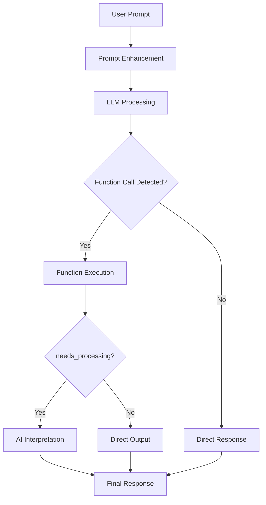

# LoLLMS Function Calls Documentation

## Overview
The LoLLMS Function Calls system allows Large Language Models (LLMs) to interact with external functions and tools. This system enables the AI to perform tasks beyond text generation, such as retrieving real-time information, performing calculations, or interacting with external APIs.

## Key Concepts

1. **Function Zoo**: A directory containing all available functions
2. **Mounted Functions**: Functions currently enabled for use by the LLM
3. **Function Call Format**: Special JSON format for invoking functions
4. **Processing Types**:
   - Direct Execution (needs_processing=False)
   - AI Interpretation (needs_processing=True)

## System Architecture



## Function Call Lifecycle

1. **Prompt Enhancement**: System adds function descriptions to user prompt
2. **LLM Processing**: AI generates response, potentially including function calls
3. **Function Detection**: System extracts and validates function calls
4. **Execution**: Selected functions are executed with provided parameters
5. **Result Processing**: Output is either shown directly or processed by AI
6. **Final Response**: Combined output is presented to user

## Creating New Functions

### Step 1: Create Function Directory
1. Navigate to functions zoo:
   ```bash
   cd {lollms_functions_zoo_path}
   ```
2. Create new directory:
   ```bash
   mkdir my_function
   cd my_function
   ```

### Step 2: Create Configuration File (config.yaml)
```yaml
name: my_function
description: Brief description of what the function does
parameters:
  param1:
    type: string
    description: Description of parameter
  param2:
    type: number
    description: Another parameter
returns:
  result1:
    type: string
    description: Description of return value
examples:
  - "Example usage 1"
  - "Example usage 2"
needs_processing: true/false
author: Your Name
version: 1.0.0
```

### Step 3: Implement Function Logic (function.py)
```python
class MyFunction:
    def __init__(self, lollmsElfServer):
        self.lollmsElfServer = lollmsElfServer
        
    def run(self, **kwargs):
        """
        Main function logic
        Returns: Dictionary containing results
        """
        # Access parameters
        param1 = kwargs.get('param1')
        param2 = kwargs.get('param2')
        
        # Your logic here
        result = perform_operation(param1, param2)
        
        return {
            "result1": result,
            "status": "success"
        }
```

### Step 4: Mount the Function
1. Add to mounted functions list in configuration
2. Or use API endpoint:
   ```bash
   POST /mount_function_call
   {
       "client_id": "your_client_id",
       "function_name": "my_function"
   }
   ```

## Function Call Format

### AI-Generated Format
```xml
<lollms_function_call>
{
    "function_name": "function_name",
    "parameters": {
        "param1": "value1",
        "param2": "value2"
    },
    "needs_processing": true/false
}
</lollms_function_call>
```

### Response Format
```json
{
    "function_name": "function_name",
    "parameters": {
        "param1": "value1",
        "param2": "value2"
    },
    "results": {
        "result1": "value1",
        "result2": "value2"
    },
    "status": "success/error",
    "message": "Additional information"
}
```

## API Endpoints

1. **List Available Functions**
   ```bash
   GET /list_function_calls
   ```

2. **List Mounted Functions**
   ```bash
   GET /list_mounted_function_calls
   ```

3. **Mount Function**
   ```bash
   POST /mount_function_call
   {
       "client_id": "your_client_id",
       "function_name": "function_name"
   }
   ```

4. **Unmount Function**
   ```bash
   POST /unmount_function_call
   {
       "client_id": "your_client_id",
       "function_name": "function_name"
   }
   ```

## Best Practices

1. **Error Handling**: Implement robust error handling in your function
2. **Parameter Validation**: Validate all inputs before processing
3. **Security**: Sanitize all inputs and outputs
4. **Documentation**: Provide clear examples and descriptions
5. **Versioning**: Maintain version numbers for compatibility
6. **Performance**: Optimize for quick execution
7. **Idempotency**: Make functions repeatable without side effects

## Example: Weather Function

### config.yaml
```yaml
name: get_weather
description: Get current weather information
parameters:
  location:
    type: string
    description: City name or coordinates
  unit:
    type: string
    enum: [celsius, fahrenheit]
    default: celsius
returns:
  temperature:
    type: number
  condition:
    type: string
examples:
  - "What's the weather in Paris?"
  - "How's the weather today?"
needs_processing: true
author: Weather Inc.
version: 1.2.0
```

### function.py
```python
import requests

class WeatherFunction:
    def __init__(self, lollmsElfServer):
        self.lollmsElfServer = lollmsElfServer
        self.api_key = "your_api_key"
        
    def run(self, **kwargs):
        location = kwargs.get('location', 'Paris')
        unit = kwargs.get('unit', 'celsius')
        
        try:
            response = requests.get(
                f"https://api.weatherapi.com/v1/current.json?key={self.api_key}&q={location}"
            )
            data = response.json()
            
            return {
                "temperature": data['current']['temp_c'] if unit == 'celsius' else data['current']['temp_f'],
                "condition": data['current']['condition']['text'],
                "location": location,
                "unit": unit,
                "status": "success"
            }
        except Exception as e:
            return {
                "status": "error",
                "message": str(e)
            }
```

This documentation provides a comprehensive guide to understanding, creating, and managing function calls in the LoLLMS system. Follow these guidelines to extend the capabilities of your LLM with custom functions.