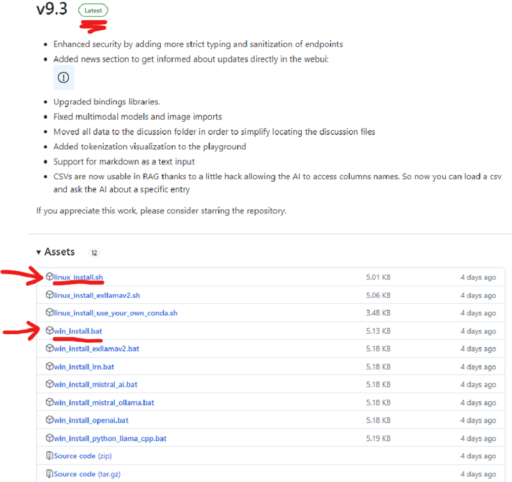
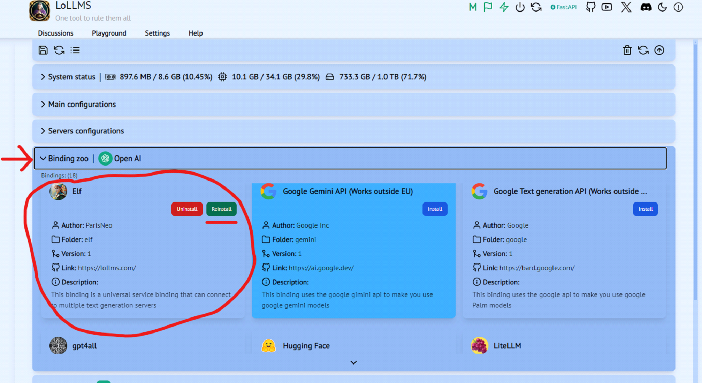
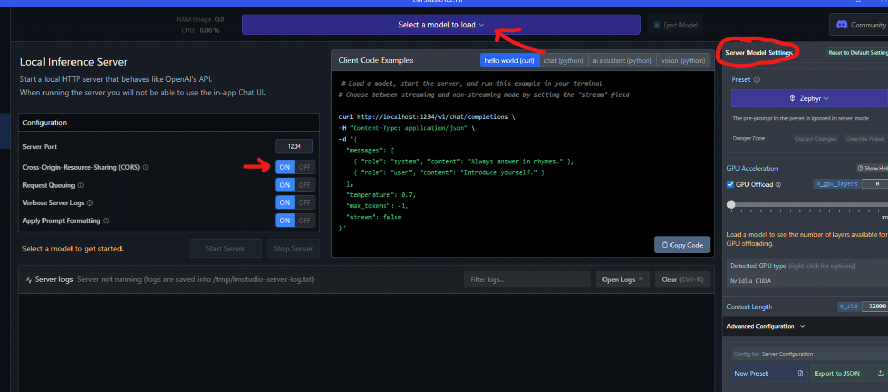
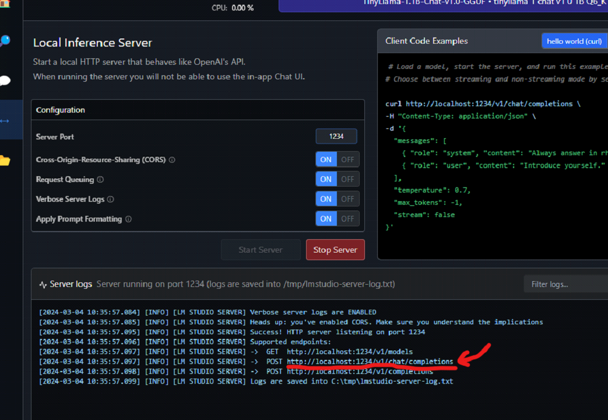
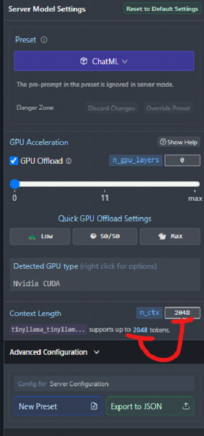
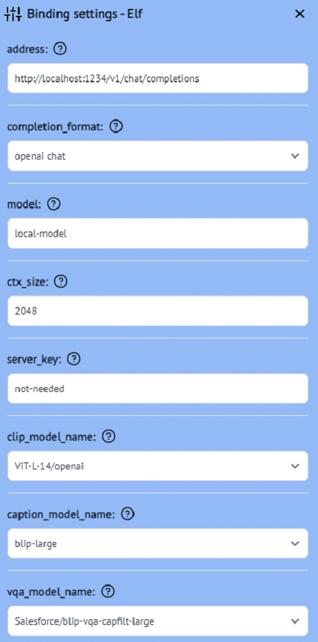
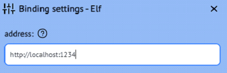

# Integrating LM Studio with LoLLMs Web UI

1. Install [LM Studio](https://lmstudio.ai/) for your OS.

2. Open LM Studio, browse / search for a model of your choosing and download it. 

3. Download [LoLLMs Web UI latest release](https://github.com/ParisNeo/lollms-webui/releases) for your OS.  Move to a folder of your choosing and run the install file - follow prompts as needed.

<figure>
    
         <alt="Latest Releases">
</figure>

4. Run LoLLMs.  Choose the ‘Settings’ tab in the LoLLMs Web UI. 

<figure>
    
         <alt="Settings Tab">
</figure>

5. Choose the ‘Binding Zoo’ subsection, scroll down to ‘Elf’ and select the ‘Install’ button. 

<figure>
    
         <alt="Binding Zoo">
</figure>

6. After install, restart LoLLMs by closing the terminal application (Windows) and relaunching LoLLMs. 

7. After the application launches, go back to the ‘Settings’ tab and choose the ‘Models Zoo’ subsection.  Simply select the ‘elf_remote_model’ option to activate it.  

8. In LM Studio, choose the ‘<-->’ Local Server option. 

9. Select the model you downloaded, apply any settings necessary (context window, preset etc) in the Server Model Settings window, and check the Cross-Origin-Resources-Sharing (CORS) box so it’s enabled.  

<figure>
    
         <alt="LM Studio Server">
</figure>

10. When done applying server settings, press the green ‘Start Server’ button.

11. In the LoLLMs WebUI, go to the ‘Settings’ tab and choose the ‘Bindings Zoo’ subsection.  Scroll down to the Elf binding option (should be the active binding) and choose the ‘Settings’ button.  
    - In the ‘address’ text box, copy the address shown here in LM Studio and paste it into this text box (NOTE: This address will not work, but is a necessary step to get this working):
    <figure>
        
             <alt="False IP Address">
    </figure>
                 
    - Set ‘completion format’ to ‘openai chat’. 
    - In the ‘model’ text box, type ‘local-model’.  
    - Set the ‘ctx_size’ text box to the maximum context size supported for your model.  This can be found in the LM Studio Server Model Settings window:
    <figure>
        
             <alt="LM Studio Server">
    </figure>
                 
    - In the ‘server_key’ text box, type ‘not-needed’.
    - Leave the rest of the settings as-is.  Your settings window should look similar to this (your address may be different):
    <figure>
        
             <alt="LM Studio Server">
    </figure>
                 
    - Press ‘Save Settings’ button.

12. Open a new discussion in LoLLMs and in the message box window type ‘test’ or something similar: 

13. In the bottom right corner you will see a ‘Could not connect to server’ error message.  Ignore this message and open LM Studio.  

14. In LM Studio look at the server logs.  Ensure that there is a red message that says something like ‘[ERROR] Unexpected endpoint or method.’.  This message is actually good as it ensures that LoLLMs is seeing your LM Studio server.  

15. Go back to LoLLMs WebUI and choose the ‘Settings’ tab.  Go to the ‘Binding Zoo’ subsection and choose the Settings button for the ‘Elf’ binding we have enabled.  Now, remove the last part of the URL for the ‘address’ up to the 4 numbers, so it should look like this:
<figure>
    
        <alt="LM Studio Server">
</figure>

16. Save the changes you made to the binding.  LoLLMs should automatically reload and put you back in the discussion you made before.  In the message box type ‘test’ and enter again.  LM Studio should now be connected to LoLLMs and the model should start generating some text. 

## IMPORTANT NOTES: 
- You must enter the address as stated in Step 11f firstly and ensure that the connection fails but is detected in the LM Studio server AND THEN edit the address to the correct one… otherwise if you put in the correct address initially it will not be detected. 
- Using the internet search toggle is buggy.  If you toggle the internet search functionality on, it is likely the first result that LM Studio provides you will fail.  Simply try again until it provides you a result.  You can check the LoLLMs log for details whether or not the search failed (something like index error etc).  You can also try slightly adjusting your prompt to see if it will work. 
- Everytime you restart the LM Studio server, you will need to repeat steps 11-16.  

