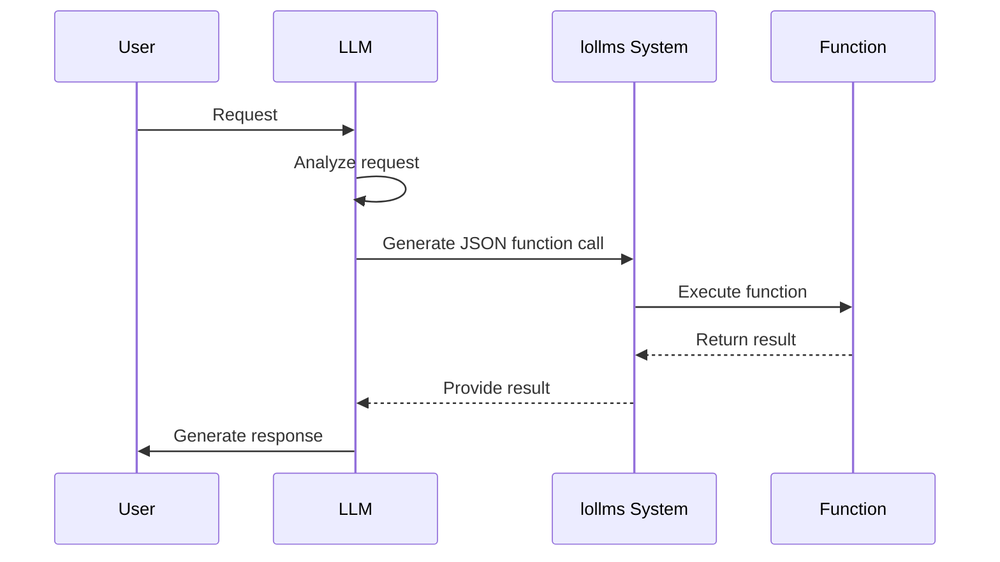

Title: "Function Calls in lollms: Empowering AI Personalities"

1. Introduction
   - Brief overview of lollms
   - Importance of function calls in enhancing AI capabilities

2. What are Function Calls?
   - Definition and purpose
   - Examples of functions (image generation, internet search, hardware interaction)

3. How Function Calls Work in lollms
   Step 1: Personality Accesses Functions
   Step 2: LLM Generates JSON Code
   Step 3: lollms Interprets the JSON
   Step 4: Function Execution
   Step 5: (Optional) Additional Text Generation

4. Visual Demonstration
   - Flowchart of the process
   - Example scenarios

5. Benefits of Function Calls in lollms
   - Enhanced capabilities
   - Flexibility and extensibility

6. Conclusion
   - Recap of key points
   - Future possibilities

Now, let's create a detailed script with visuals:

Script:

1. Introduction
   [Show lollms logo]
   Narrator: "Welcome to lollms, the Lord of Large Language Multimodal Systems. Today, we're diving into one of lollms' most powerful features: function calls."

2. What are Function Calls?
   [Show icons representing different functions]
   Narrator: "Function calls allow AI personalities to perform specific tasks beyond text generation. These can include image creation, internet searches, and even hardware interactions."

3. How Function Calls Work in lollms
   [Display the flowchart as each step is explained]
   Narrator: "Let's break down the process:"

   Step 1: Personality Accesses Functions
   "AI personalities in lollms have access to one or multiple functions, depending on their configuration."

   Step 2: LLM Generates JSON Code
   "When a specific function is needed, the LLM generates a JSON code to trigger it."

   Step 3: lollms Interprets the JSON
   "The lollms system interprets this JSON code."

   Step 4: Function Execution
   "Based on the interpretation, lollms executes the appropriate function."

   Step 5: (Optional) Additional Text Generation
   "Depending on the function type, another round of text generation might be required to process the results."

4. Visual Demonstration
   [Show example scenarios with code snippets]
   Narrator: "Let's look at some examples:"

   Example 1: Image Generation
   [Display JSON code for image generation and a resulting image]
   "Here, the LLM generates JSON to create an image, and lollms processes it to produce the visual."

   Example 2: Internet Search
   [Show JSON for an internet search and search results]
   "In this case, the function call triggers an internet search, providing the LLM with up-to-date information."

5. Benefits of Function Calls in lollms
   [List benefits with animated icons]
   Narrator: "Function calls in lollms offer:
   - Enhanced capabilities beyond text generation
   - Flexibility to add new functions as needed
   - Real-time interaction with external systems and data"

6. Conclusion
   [Show lollms logo again]
   Narrator: "Function calls are what make lollms truly powerful, allowing AI personalities to interact with the world in meaningful ways. As we continue to develop new functions, the possibilities are endless."

To create this video, we would need to:
1. Record the narration
2. Create or source appropriate visuals (logos, icons, flowcharts)
3. Animate the flowchart and examples
4. Add background music and sound effects
5. Edit everything together into a cohesive video
